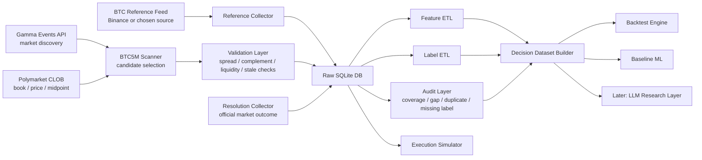
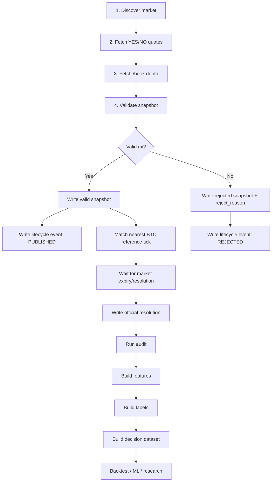
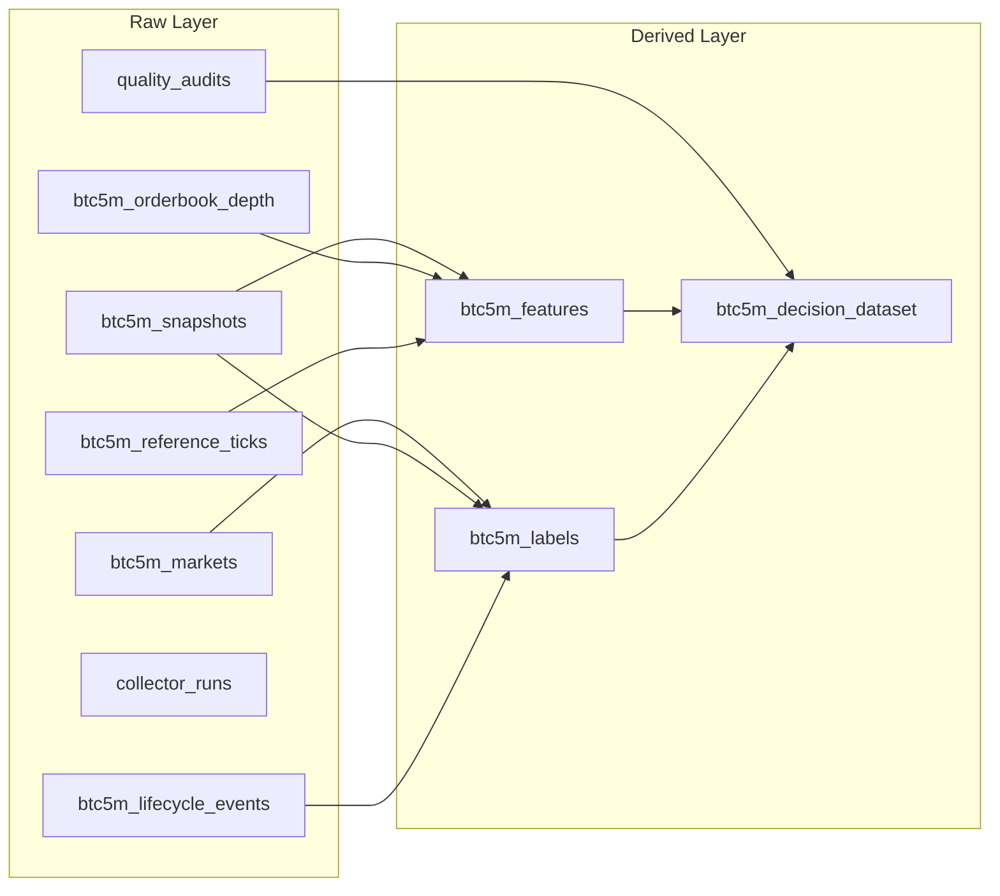
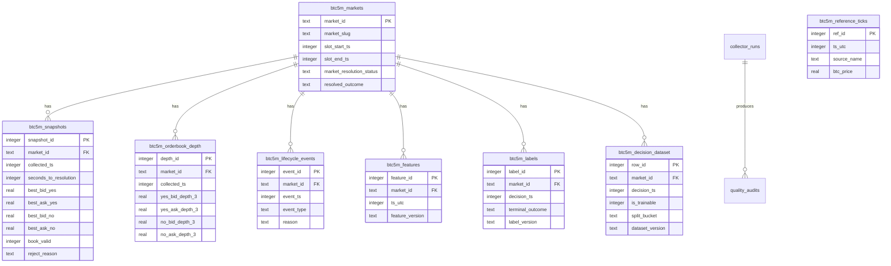
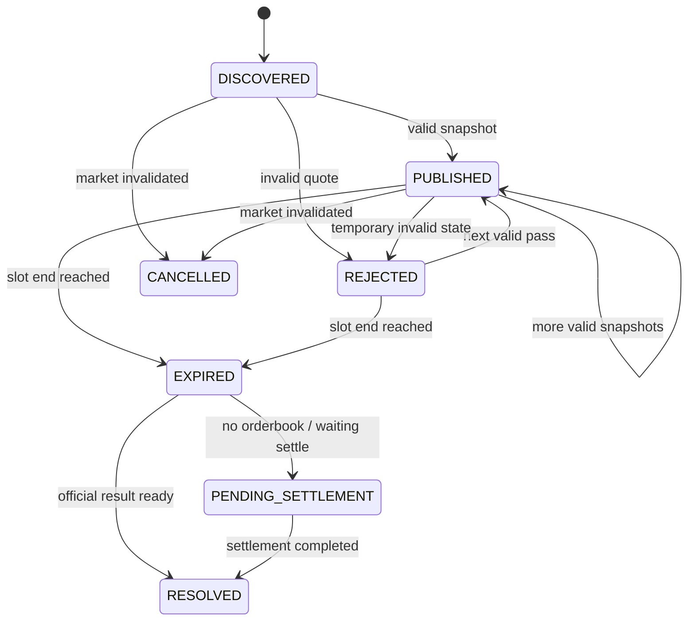
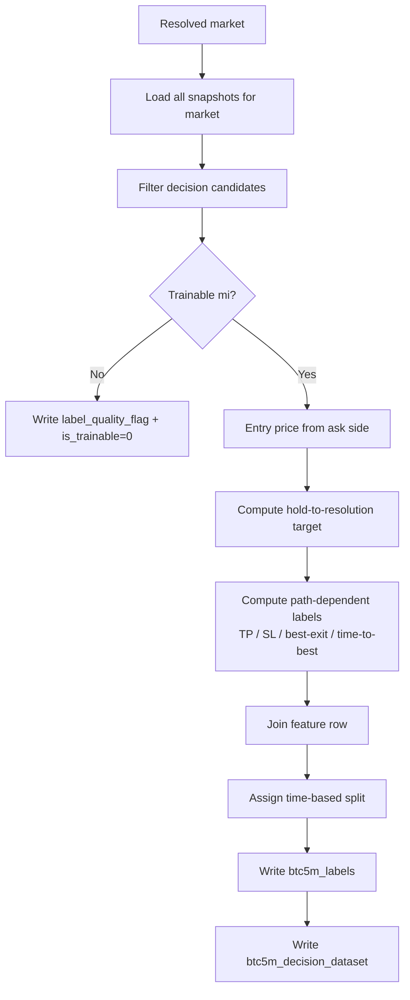
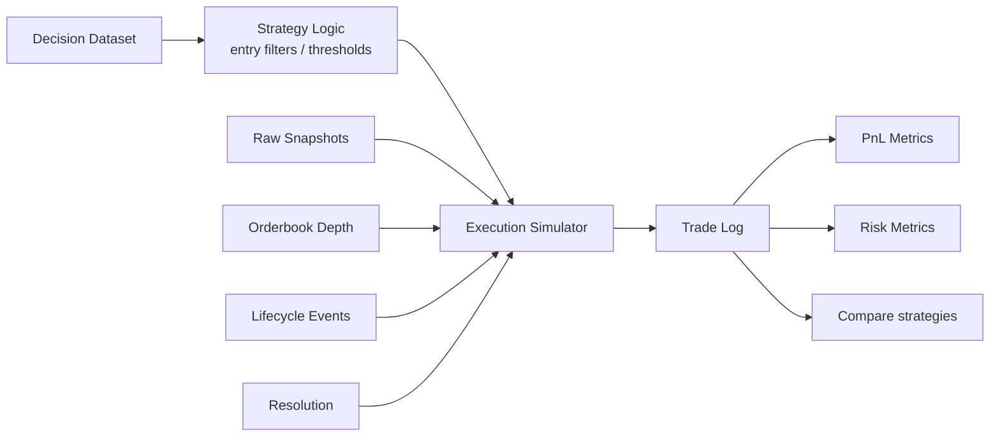
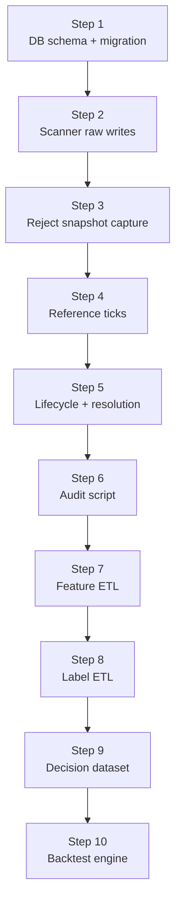

# BTC5M Dataset Architecture Diagram

## 1. Buyuk resim
Asagidaki diyagram, BTC 5min up/down dataset akisini uctan uca gosterir.

Bu akisin anlami:
- Scanner marketi bulur ve quote toplar.
- Reference collector BTC tarafini toplar.
- Resolution collector resmi sonucu toplar.
- Hepsi once raw DB'ye gider.
- Derived katman sonra uretilir.
- Backtest ve ML raw yerine dogrudan decision dataset + raw execution katmanini kullanir.

---

## 2. Sistem nasil calisacak?

Buradaki en kritik nokta:
- invalid veya reject olan data cope atilmiyor
- onlar da dataset'in parcasi oluyor
- cunku gercek dunya execution kalitesi ve signal reliability ancak boyle anlasilir

---

## 3. Raw ve derived ayrimi

Mantik su:
- raw tablolar gercegin arsivi
- derived tablolar experiment urunu
- feature veya label formulu degisirse raw'a dokunmadan yeniden uretiriz

---

## 4. Tablo iliskileri

Not:
- `btc5m_reference_ticks` markete direkt FK ile bagli degil.
- join, zaman uzerinden yapiliyor.

---

## 5. Market lifecycle
Bu kisim zihinde net oturmali cunku backtest davranisi buradan cikacak.

Bu state machine neden gerekli?
- cunku "trade acilabilir market" ile "sadece resolve bekleyen market" ayni sey degil
- incident'te gordugumuz no-orderbook durumu backtest'e aynen yansitilmali

---

## 6. Label nasil ureyecek?

Kritik kural:
- feature sadece gecmise bakar
- label gelecegi kullanabilir
- train/test split market-slot bazli olur

---

## 7. Backtest motoru bu datayi nasil kullanacak?

Backtest sadece label'a bakip "dogru tahmin etti mi" demeyecek.
Su sorulara da cevap verecek:
- gercekten fill olabilir miydi?
- spread maliyeti neydi?
- expiry once cikis mumkun muydu?
- no-orderbook durumunda ne olurdu?

---

## 8. Uygulama sirasi

Bu sira neden dogru?
- once veri kaybi durur
- sonra veri kalitesi olculur
- sonra research katmani insa edilir

---

## 9. Kisa ozet
Bu sistemde yapacagimiz sey aslinda 3 katmanli:

1. Collection
   Scanner + reference + resolution -> raw DB

2. Data engineering
   Audit + feature ETL + label ETL -> derived dataset

3. Research
   Backtest + ML + sonra gerekirse LLM

En onemli ilke:
- once dogru veri
- sonra dogru label
- sonra strateji

---

**Bagli dokumanlar:**
- [Backtest_Data_Collection_Plan.md](Backtest_Data_Collection_Plan.md)
- [BTC5M_Dataset_Implementation_Spec.md](BTC5M_Dataset_Implementation_Spec.md)
