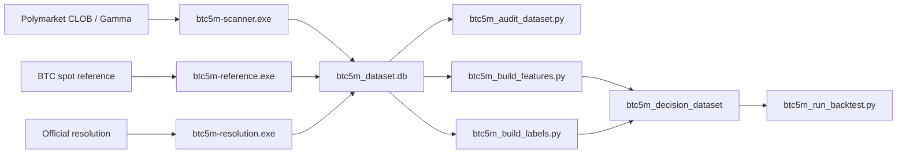

# prediction-market-data-pipeline

Research-grade data collection and dataset-building pipeline for Polymarket BTC 5-minute up/down markets.

Preferred public repository name: `prediction-market-data-pipeline`

This repository is focused on one problem:

- collect live BTC 5-minute prediction market data
- measure data quality numerically
- build leak-safe research datasets
- generate labels from official market resolutions
- run execution-aware backtests on the resulting dataset

The repo is Windows-first today because the current operational stack uses PowerShell, Task Scheduler, and a persistent monitor console.

## Repository Status

- Windows-first operational stack for a single always-on collection machine
- actively used for live BTC 5-minute market collection
- safe to explore without starting collectors
- if you do start collectors, they will write local runtime artifacts under `runtime/`

## What This Project Does

This project continuously collects and stores:

- Polymarket BTC 5-minute market snapshots
- top-of-book and depth summaries for YES/NO sides
- BTC spot reference ticks
- market lifecycle and official resolution outcomes
- dataset quality audits, health checks, and backups

Then it can build:

- derived features
- official-resolution labels
- a trainable decision dataset
- execution-aware backtest outputs

## Why It Exists

Prediction market research gets noisy fast if the raw collection layer is weak.

This repo was built to solve the data problem first:

- no future leakage in feature generation
- explicit quality gating at slot level
- reproducible ETL outputs
- operational monitoring for unattended collection

## Current Scope

Supported now:

- BTC 5-minute Polymarket up/down markets
- BTC spot reference feed
- official resolution collection
- quality audits
- feature and label ETL
- execution-aware backtesting

Not the focus of this repo:

- generic all-market support
- cloud deployment automation
- polished cross-platform packaging

## Repository Map

- [common](common)
  Shared database helpers, lock handling, operational status, feeds, and backtest engine.
- [polymarket_scanner](polymarket_scanner)
  Live BTC5M market scanner and snapshot publisher.
- [scripts](scripts)
  Audit, backup, feature build, label build, decision dataset build, summaries, and backtest runner.
- [control](control)
  Collector control scripts, monitor console, and scheduler registration.
- [PROJECT_MANAGEMENT](PROJECT_MANAGEMENT)
  Specs, architecture notes, runbooks, and planning documents.

## Main Data Tables

The live SQLite dataset is:

- `runtime/data/btc5m_dataset.db`

Core tables:

- `btc5m_markets`
- `btc5m_snapshots`
- `btc5m_orderbook_depth`
- `btc5m_reference_ticks`
- `btc5m_reference_1m_ohlcv`
- `btc5m_lifecycle_events`
- `quality_audits`
- `btc5m_features`
- `btc5m_labels`
- `btc5m_decision_dataset`

## Architecture



## Quick Start

This section is written for someone who has never run the project before.

### 1. Install prerequisites

You need:

- Windows 10 or 11
- Python 3.11
- Git
- PowerShell

Optional but useful:

- [DB Browser for SQLite](https://sqlitebrowser.org/)
- NordVPN or another VPN if you need region-specific routing for Polymarket access

### 2. Clone the repository

Use either the SSH or HTTPS clone URL:

```powershell
git clone git@github.com:Chelebii/prediction-market-data-pipeline.git
cd prediction-market-data-pipeline
```

```powershell
git clone https://github.com/Chelebii/prediction-market-data-pipeline.git
cd prediction-market-data-pipeline
```

### 3. Create a virtual environment

```powershell
python -m venv .venv
.\.venv\Scripts\Activate.ps1
```

### 4. Install Python dependencies

```powershell
pip install -r requirements.txt
```

### 5. Create your local environment file

Copy the example file:

```powershell
Copy-Item polymarket_scanner\.env.example polymarket_scanner\.env
```

Then edit:

- `polymarket_scanner/.env`

Minimal setup:

- leave the defaults as-is for a basic local run
- Telegram bot credentials are optional and only needed if you want alerts
- the example file already includes the runtime paths and collector thresholds used by the current Windows workflow

Important:

- do not commit your real `.env`
- `.env` is already ignored by Git

### 6. Prepare collector-specific executables

These make VPN split tunneling practical by giving each collector a unique process name.

```powershell
powershell -ExecutionPolicy Bypass -File control\scripts\ensure_btc5m_process_exes.ps1
```

Expected process names:

- `btc5m-scanner.exe`
- `btc5m-reference.exe`
- `btc5m-resolution.exe`

### 7. Start live data collection

```powershell
powershell -ExecutionPolicy Bypass -File control\scripts\btc5m_collection_control.ps1 -Action start
```

This command is intended to be safe to re-run.
If the collectors are already running, the control script should detect that and avoid starting duplicates.

Or start the full monitor flow:

```powershell
control\scripts\start_btc5m_collectors.cmd
```

### 8. Register periodic tasks

```powershell
powershell -ExecutionPolicy Bypass -File control\scripts\register_btc5m_collection_tasks.ps1 -Action register
```

This sets up:

- health check every 5 minutes
- dataset audit every 15 minutes
- backup every 6 hours

### 9. Check whether the system is healthy

```powershell
python scripts\btc5m_collection_summary.py
```

What you want to see:

- collectors are `RUNNING`
- snapshot freshness is low
- reference freshness is low
- no urgent warnings

If freshness stays high or warnings persist after a minute or two, check the runbook and the monitor console before assuming the dataset is unusable.

### 10. Inspect the live data yourself

Open the live DB in DB Browser for SQLite:

- `runtime/data/btc5m_dataset.db`

Useful tables to browse first:

- `btc5m_snapshots`
- `btc5m_reference_ticks`
- `btc5m_markets`
- `quality_audits`

## First-Run Checklist

After initial setup, a healthy first run usually looks like this:

- the three collector processes appear as `btc5m-scanner.exe`, `btc5m-reference.exe`, and `btc5m-resolution.exe`
- `python scripts\btc5m_collection_summary.py` reports no urgent warnings
- `runtime/data/btc5m_dataset.db` starts growing
- `runtime/logs/` contains fresh collector log files

## Day-to-Day Commands

Start collectors:

```powershell
powershell -ExecutionPolicy Bypass -File control\scripts\btc5m_collection_control.ps1 -Action start
```

Stop collectors:

```powershell
powershell -ExecutionPolicy Bypass -File control\scripts\btc5m_collection_control.ps1 -Action stop
```

Restart collectors:

```powershell
powershell -ExecutionPolicy Bypass -File control\scripts\btc5m_collection_control.ps1 -Action restart
```

Status:

```powershell
powershell -ExecutionPolicy Bypass -File control\scripts\btc5m_collection_control.ps1 -Action status
```

Operational summary:

```powershell
python scripts\btc5m_collection_summary.py
```

JSON summary:

```powershell
python scripts\btc5m_collection_summary.py --json
```

Manual audit:

```powershell
python scripts\btc5m_audit_dataset.py --lookback-hours 48 --max-markets 250 --include-active
```

Manual backup:

```powershell
python scripts\btc5m_backup_dataset.py
```

## Build the Research Dataset

Once enough live data has been collected, run the ETL stages.

Build features:

```powershell
python scripts\btc5m_build_features.py --feature-version v1
```

Build labels:

```powershell
python scripts\btc5m_build_labels.py --label-version v1
```

Build final decision dataset:

```powershell
python scripts\btc5m_build_decision_dataset.py --dataset-version v1 --feature-version v1 --label-version v1
```

Run a baseline backtest:

```powershell
python scripts\btc5m_run_backtest.py --dataset-version v1 --feature-version v1 --split-bucket train --strategy momentum
```

## Public Repo Safety Notes

This repository is intended to be public-safe, but there are rules:

- never commit real `.env` files
- never commit `runtime/`
- never commit live `.db` files
- never commit private keys or API credentials
- rotate credentials immediately if they are ever pasted into tracked files

Ignored by default:

- `.env`
- `runtime/`
- `state/`
- `*.db`
- `*.db-shm`
- `*.db-wal`
- `*.log`
- `*.lock`

## Secret History Check

I performed a repository history check for the current publicization work.

What was checked:

- tracked `.env` paths in Git history
- known Telegram token / chat id strings
- known Polymarket live credential strings

Current result:

- no tracked `polymarket_scanner/.env` history found
- no matches found for the currently known local token / key values in reachable Git history

Important operational note:

- local ignored `.env` files can still contain real secrets
- that is fine for local use
- but those values should still be treated as sensitive and rotated if they were ever shared outside the machine

## VPN / Split Tunnel

If you need region-specific routing, read:

- [BTC5M_VPN_Split_Tunnel_Setup.md](PROJECT_MANAGEMENT/Historical_Data_and_Backtesting/Strategy/BTC5M_VPN_Split_Tunnel_Setup.md)

If you use NordVPN split tunneling, the intended collector apps are:

- `btc5m-scanner.exe`
- `btc5m-reference.exe`
- `btc5m-resolution.exe`

## Monitoring and Operations

Main operational reference:

- [BTC5M_Live_Data_Collection_Runbook.md](PROJECT_MANAGEMENT/Historical_Data_and_Backtesting/Strategy/BTC5M_Live_Data_Collection_Runbook.md)

The monitor console is designed to stay quiet when everything is healthy and only print on state change or intervention-worthy problems.

## Resume-Ready Project Description

Short version:

> Built an end-to-end data pipeline for Polymarket BTC 5-minute prediction markets, including live market collection, quality auditing, feature/label ETL, and execution-aware backtesting.

Stronger CV bullets:

- Built a research-grade dataset pipeline for BTC 5-minute prediction markets using live order book snapshots, BTC reference ticks, and official market resolutions.
- Designed slot-level quality auditing, outage detection, leak-safe feature engineering, and reproducible decision-dataset generation for strategy research.
- Implemented unattended operational tooling for long-running collection, including process supervision, health checks, monitoring, backup/restore, and failure diagnostics.

## License

No license file has been added yet.
If you want to make the repository public for reuse by others, add an explicit license before publishing.
