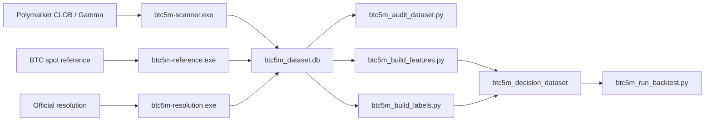

# prediction-market-data-pipeline

Research-grade data collection and dataset-building pipeline for Polymarket BTC 5-minute up/down markets.

This repository is a **data pipeline**, not an automated trading bot. Its job is to collect market data, measure data quality, build research datasets, and support backtesting.

## What This Repo Does

- collects live BTC 5-minute Polymarket market snapshots
- stores top-of-book and depth summaries for YES/NO order books
- records BTC spot reference ticks
- tracks official market resolutions
- runs quality audits, health checks, and backups
- builds leak-safe features, labels, and decision datasets
- runs execution-aware backtests on the resulting dataset

## Scope

Supported now:

- BTC 5-minute Polymarket up/down markets
- BTC spot reference feed
- official resolution collection
- quality audits
- feature and label ETL
- execution-aware backtesting

Not the focus of this repo:

- generic all-market support
- cloud deployment automation
- cross-platform packaging
- direct order execution or live trading automation

## Why It Exists

Prediction market research gets noisy fast if the collection layer is weak. This repo is built to solve the data problem first:

- reproducible ETL outputs
- no future leakage in feature generation
- explicit slot-level quality gating
- operational monitoring for unattended collection

## Architecture



## Repository Map

- [common](common)
  Shared database helpers, lock handling, operational status, feeds, and backtest engine.
- [polymarket_scanner](polymarket_scanner)
  Live BTC5M market scanner and snapshot publisher.
- [scripts](scripts)
  Audit, backup, setup verification, feature build, label build, decision dataset build, summaries, and backtest runner.
- [control](control)
  Collector control scripts, monitor console, and scheduler registration.
- [PROJECT_MANAGEMENT](PROJECT_MANAGEMENT)
  Specs, architecture notes, runbooks, and planning documents.

## Main Data Tables

The live SQLite dataset is stored at `runtime/data/btc5m_dataset.db`.

Core tables:

- `btc5m_markets`
- `btc5m_snapshots`
- `btc5m_orderbook_depth`
- `btc5m_reference_ticks`
- `btc5m_reference_1m_ohlcv`
- `btc5m_lifecycle_events`
- `quality_audits`
- `btc5m_features`
- `btc5m_labels`
- `btc5m_decision_dataset`

## Quick Start

This setup path is written for a fresh clone on a Windows machine.

### 1. Install prerequisites

Required:

- Windows 10 or 11
- Python 3.11
- Git
- PowerShell

Optional but useful:

- [DB Browser for SQLite](https://sqlitebrowser.org/)
- NordVPN or another VPN if you need region-specific routing for Polymarket access

### 2. Clone the repository

```powershell
git clone git@github.com:Chelebii/prediction-market-data-pipeline.git
cd prediction-market-data-pipeline
```

or

```powershell
git clone https://github.com/Chelebii/prediction-market-data-pipeline.git
cd prediction-market-data-pipeline
```

### 3. Create a virtual environment

```powershell
python -m venv .venv
.\.venv\Scripts\Activate.ps1
```

### 4. Install Python dependencies

```powershell
pip install -r requirements.txt
```

### 5. Create your local environment file

```powershell
Copy-Item polymarket_scanner\.env.example polymarket_scanner\.env
```

Then edit `polymarket_scanner/.env` as needed.

Notes:

- the example file is safe to keep as-is for basic local setup
- Telegram credentials are optional and only needed for alerts
- runtime paths in the example file are repo-relative by default
- real `.env` files are ignored by Git

### 6. Run the non-live setup verification

This check does **not** start collectors or write dataset rows. It verifies that the clone has the expected files, Python version, dependencies, and local env shape.

```powershell
python scripts\btc5m_verify_setup.py
```

If you prefer structured output:

```powershell
python scripts\btc5m_verify_setup.py --json
```

### 7. Prepare collector-specific executables

Recommended on Windows, and effectively required if you want VPN split tunneling by process name.

```powershell
powershell -ExecutionPolicy Bypass -File control\scripts\ensure_btc5m_process_exes.ps1
```

Expected process names:

- `btc5m-scanner.exe`
- `btc5m-reference.exe`
- `btc5m-resolution.exe`

### 8. Start live data collection

```powershell
powershell -ExecutionPolicy Bypass -File control\scripts\btc5m_collection_control.ps1 -Action start
```

Or start the full monitor flow:

```powershell
control\scripts\start_btc5m_collectors.cmd
```

The control script is intended to be safe to re-run and should avoid duplicate long-running collectors.

### 9. Register periodic tasks

```powershell
powershell -ExecutionPolicy Bypass -File control\scripts\register_btc5m_collection_tasks.ps1 -Action register
```

This registers:

- health check every 5 minutes
- dataset audit every 15 minutes
- backup every 6 hours

### 10. Check whether the system is healthy

```powershell
python scripts\btc5m_collection_summary.py
```

What you want to see:

- collectors are `RUNNING`
- snapshot freshness is low
- reference freshness is low
- no urgent warnings

### 11. Inspect the live data

Open `runtime/data/btc5m_dataset.db` in DB Browser for SQLite and look at:

- `btc5m_snapshots`
- `btc5m_reference_ticks`
- `btc5m_markets`
- `quality_audits`

## First-Run Checklist

A healthy first run usually looks like this:

- the three collector processes appear as `btc5m-scanner.exe`, `btc5m-reference.exe`, and `btc5m-resolution.exe`
- `python scripts\btc5m_collection_summary.py` reports no urgent warnings
- `runtime/data/btc5m_dataset.db` starts growing
- `runtime/logs/` contains fresh collector log files

## Day-to-Day Commands

Start collectors:

```powershell
powershell -ExecutionPolicy Bypass -File control\scripts\btc5m_collection_control.ps1 -Action start
```

Stop collectors:

```powershell
powershell -ExecutionPolicy Bypass -File control\scripts\btc5m_collection_control.ps1 -Action stop
```

Restart collectors:

```powershell
powershell -ExecutionPolicy Bypass -File control\scripts\btc5m_collection_control.ps1 -Action restart
```

Status:

```powershell
powershell -ExecutionPolicy Bypass -File control\scripts\btc5m_collection_control.ps1 -Action status
```

Operational summary:

```powershell
python scripts\btc5m_collection_summary.py
```

JSON summary:

```powershell
python scripts\btc5m_collection_summary.py --json
```

Manual audit:

```powershell
python scripts\btc5m_audit_dataset.py --lookback-hours 48 --max-markets 250 --include-active
```

Manual backup:

```powershell
python scripts\btc5m_backup_dataset.py
```

## Build the Research Dataset

Once enough live data has been collected, run the ETL stages.

Build features:

```powershell
python scripts\btc5m_build_features.py --feature-version v1
```

Build labels:

```powershell
python scripts\btc5m_build_labels.py --label-version v1
```

Build final decision dataset:

```powershell
python scripts\btc5m_build_decision_dataset.py --dataset-version v1 --feature-version v1 --label-version v1
```

Run a baseline backtest:

```powershell
python scripts\btc5m_run_backtest.py --dataset-version v1 --feature-version v1 --split-bucket train --strategy momentum
```

## Known Limitations

- Windows-first operational tooling; Linux/macOS are not the primary target yet
- setup is optimized for one always-on collection machine
- VPN routing requirements depend on your jurisdiction and network setup
- no packaged installer or container workflow is provided yet
- no automated test suite is shipped yet; use `python scripts\btc5m_verify_setup.py` and the live operational summary for verification

## Public Repo Safety

Do not commit:

- real `.env` files
- `runtime/`
- live `.db` files
- private keys or API credentials

Ignored by default:

- `.env`
- `.env.*`
- `runtime/`
- `state/`
- `*.db`
- `*.db-shm`
- `*.db-wal`
- `*.log`
- `*.log.*`
- `*.lock`
- `*.pem`
- `*.key`
- `*.p12`
- `*.pfx`

## Operational Docs

- [BTC5M Live Data Collection Runbook](PROJECT_MANAGEMENT/Historical_Data_and_Backtesting/Strategy/BTC5M_Live_Data_Collection_Runbook.md)
- [BTC5M VPN Split Tunnel Setup](PROJECT_MANAGEMENT/Historical_Data_and_Backtesting/Strategy/BTC5M_VPN_Split_Tunnel_Setup.md)
- [BTC5M Dataset Implementation Spec](PROJECT_MANAGEMENT/Historical_Data_and_Backtesting/Strategy/BTC5M_Dataset_Implementation_Spec.md)

## License

[MIT](LICENSE)
