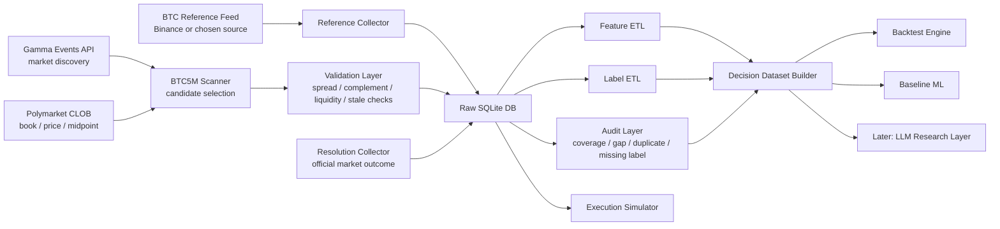
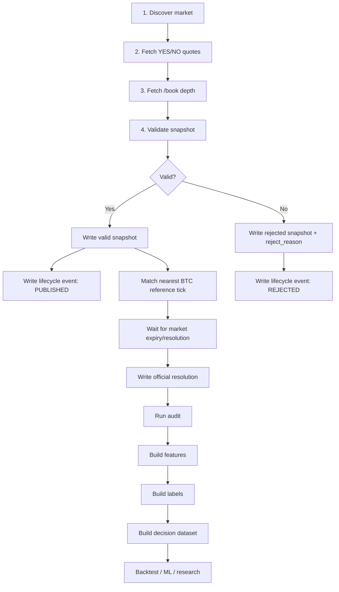
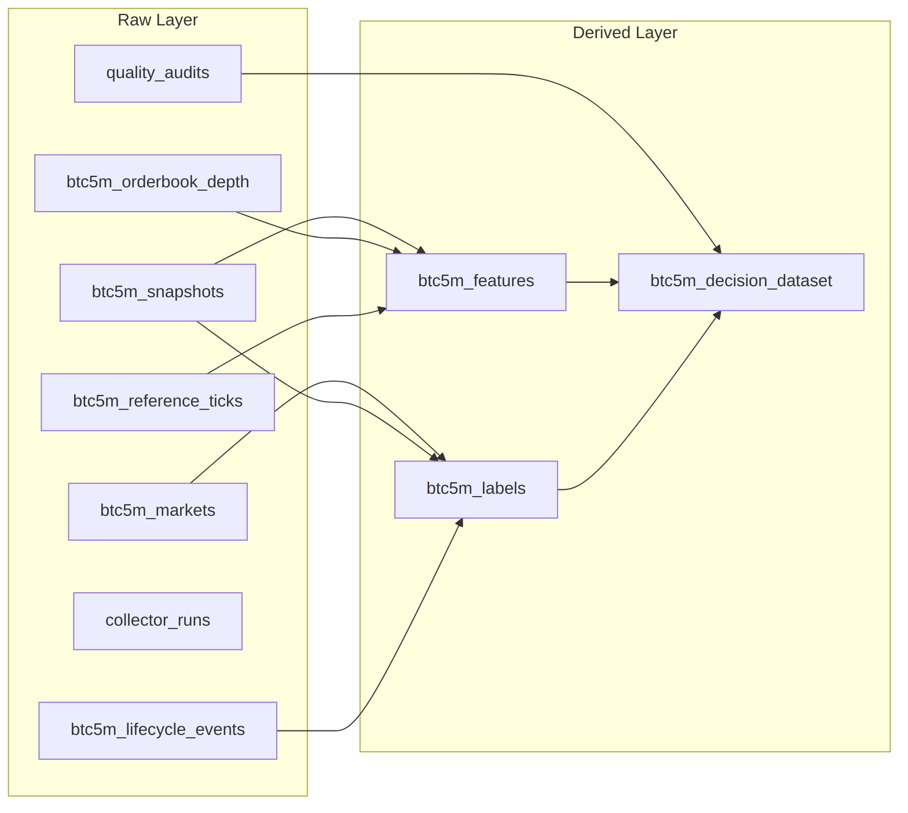
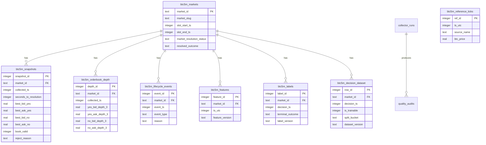
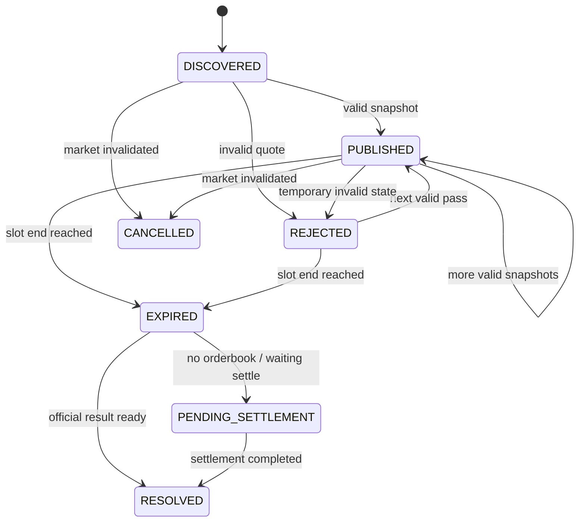
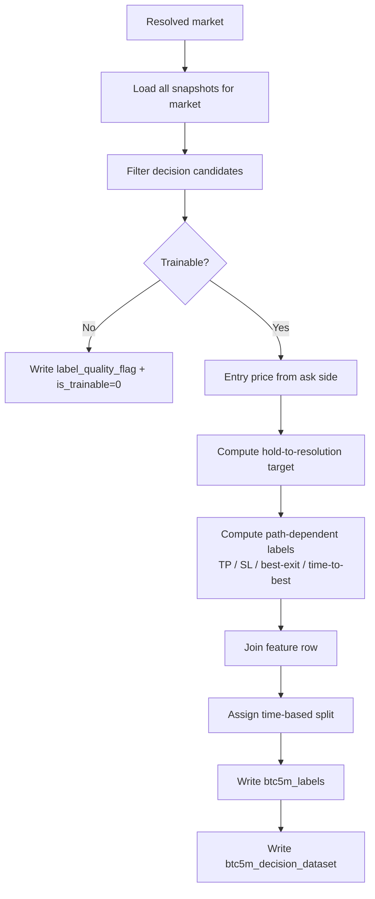
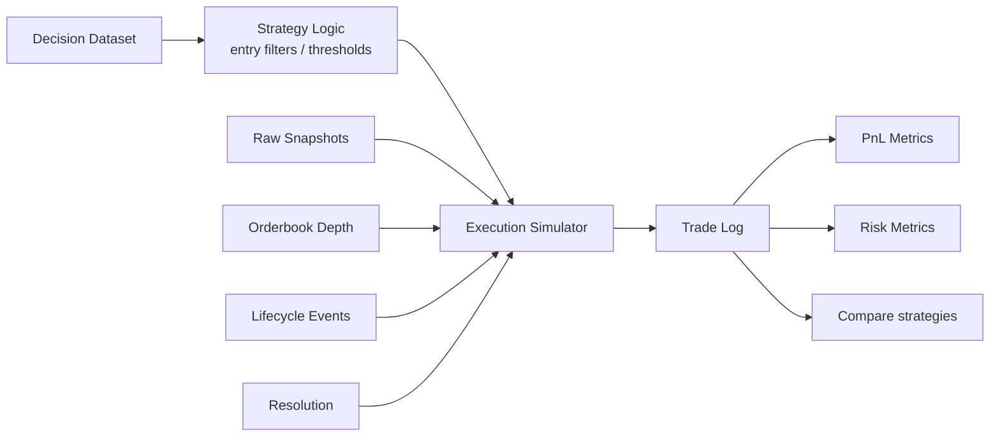
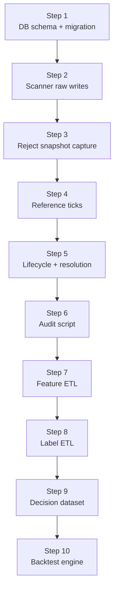

# BTC5M Dataset Architecture Diagram

## 1. Big Picture

The diagram below shows the end-to-end BTC 5-minute up/down dataset flow.

What this flow means:

- The scanner discovers markets and collects quotes.
- The reference collector captures the BTC side.
- The resolution collector captures the official outcome.
- All of them first write to the raw database.
- The derived layer is produced afterward.
- Backtesting and ML use the decision dataset plus the raw execution layer directly, rather than consuming raw tables blindly.

---

## 2. How Will the System Work?

The most critical point here is:

- invalid or rejected data is not thrown away
- it also becomes part of the dataset
- because real-world execution quality and signal reliability can only be understood this way

---

## 3. Raw vs. Derived Separation

The logic is:

- raw tables are the archive of reality
- derived tables are experiment products
- if the feature or label formula changes, we regenerate without touching raw data

---

## 4. Table Relationships

Note:

- `btc5m_reference_ticks` is not directly linked to a market via a foreign key.
- The join is done through time.

---

## 5. Market Lifecycle

This part must be mentally clear because backtest behavior will come from here.

Why is this state machine necessary?

- because a "tradable market" and a "market only waiting for resolution" are not the same thing
- the no-orderbook condition we saw in incidents must be reflected exactly in backtesting

---

## 6. How Will Labels Be Produced?

Critical rule:

- features only look backward
- labels may use future information
- train/test splitting is market-slot-based

---

## 7. How Will the Backtest Engine Use This Data?

The backtest will not simply look at the label and ask, "Did it predict correctly?"
It must also answer:

- could it really have been filled?
- what was the spread cost?
- was it possible to exit before expiry?
- what would happen in a no-orderbook condition?

---

## 8. Implementation Order

Why is this order correct?

- first, data loss is stopped
- then data quality is measured
- then the research layer is built

---

## 9. Short Summary

What we are actually building in this system is a three-layer structure:

1. Collection
   Scanner + reference + resolution -> raw DB

2. Data engineering
   Audit + feature ETL + label ETL -> derived dataset

3. Research
   Backtest + ML + later, if needed, LLM

The most important principle:

- first correct data
- then correct labels
- then strategy

---

**Related documents:**
- [Backtest_Data_Collection_Plan.md](../strategy/Backtest_Data_Collection_Plan.md)
- [BTC5M_Dataset_Implementation_Spec.md](../strategy/BTC5M_Dataset_Implementation_Spec.md)
